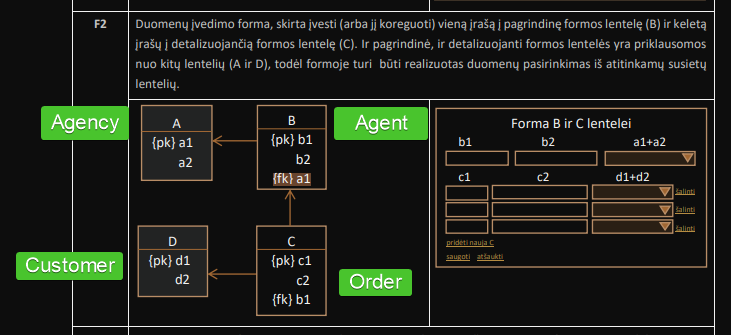

# Trips agency

This is a simple ASP-NET application to manage trips agency database.

## Database structure



[LAB2 requirements](docs/pdf/LAB2.pdf)

[LAB3 requirements](docs/pdf/LAB3.pdf)

### Old queries

```mariadb
SELECT orders.id                                                AS order_id,
       CONCAT(agents.first_name, ' ', agents.last_name)         AS agent,
       orders.adults_count + orders.children_count              AS total_passengers,
       orders.final_price                                       AS total_price,
       order_status.name                                        AS status,
       size.name                                                AS luggage_size,
       CONCAT(customers.first_name, ' ', customers.last_name)   AS customer,
       trip_details.destination                                 AS trip_destination,
       DATEDIFF(trip_details.end_date, trip_details.start_date) AS trip_duration,
       ROUND(IFNULL(orders.final_price / DATEDIFF(trip_details.end_date, trip_details.start_date), 0),
             2)                                                 AS price_per_day,
       ROUND(IFNULL(orders.final_price / (orders.adults_count + orders.children_count), 0),
             2)                                                 AS price_per_passenger,
       IFNULL(trip_details.hotel_name, 'No hotel')              AS hotel_name,


       SUM(orders.adults_count + orders.children_count)    AS summ,
       COUNT(orders.id)                                         AS total_orders,
       AVG(orders.final_price)                                  AS average_price

FROM orders
         INNER JOIN (SELECT trips.nr,
                            trips.destination,
                            trips.start_date,
                            trips.end_date,
                            trips.fk_hotel_service,
                            hotel_details.title AS hotel_name
                     FROM trips
                              LEFT JOIN (SELECT hotels.title,
                                                hotels.id,
                                                hotels_services.fk_hotel
                                         FROM hotels
                                                  INNER JOIN hotels_services ON hotels.id = hotels_services.fk_hotel) AS hotel_details
                                        ON trips.fk_hotel_service = hotel_details.id) AS trip_details
                    ON orders.fk_trip = trip_details.nr
         INNER JOIN order_status ON orders.status = order_status.id
         INNER JOIN size ON orders.luggage_size = size.id
         INNER JOIN agents ON orders.fk_agent = agents.id
         INNER JOIN customers ON orders.fk_customer = customers.personal_id
GROUP BY orders.id, agents.id
ORDER BY agent, order_id;
```

### Current queries

```mariadb

SELECT CONCAT(ta.id, ' - ', ta.title)             AS travel_agency,
       CONCAT(trips.nr, ' - ', trips.destination) AS trip,
       tour_type.name                             AS trip_type,
       DATEDIFF(trips.end_date, trips.start_date) AS trip_duration,
       IFNULL(hotel_details.title, '-')           AS hotel_name,
       IFNULL(ord.count, 0)                       AS orders_count,
       IFNULL(ord.children, 0)                    AS total_children,
       IFNULL(ord.adults, 0)                      AS total_adults,
       IFNULL(ord.price, 0)                       AS total_price
FROM trips
         LEFT JOIN
     (SELECT hotels.title,
             hotels.id,
             hotels_services.fk_hotel
      FROM hotels
               INNER JOIN hotels_services ON hotels.id = hotels_services.fk_hotel) AS hotel_details
     ON trips.fk_hotel_service = hotel_details.id
         LEFT JOIN travel_agencies ta on ta.id = trips.fk_travel_agency
         LEFT JOIN (SELECT orders.fk_trip,
                           COUNT(orders.id)           AS count,
                           SUM(orders.children_count) AS children,
                           SUM(orders.adults_count)   AS adults,
                           SUM(orders.final_price)    AS price
                    FROM orders
                    GROUP BY orders.fk_trip) AS ord
                   ON trips.nr = ord.fk_trip
         INNER JOIN tour_type ON trips.type = tour_type.id
WHERE IFNULL(ord.children, 0) + IFNULL(ord.adults, 0) >= 0
  AND IFNULL(ord.price, 0) >= 0
  AND IFNULL(ord.count, 0) >= 0
  AND tour_type.name = 'recreational'
GROUP BY trips.nr
ORDER BY travel_agency, trip;


/*
Agenturu grupes

Kelione ir jos uzsakymu statistika

One trip - many orders

Keleiviu skaicius
Vaiku skaicius
Suaugusiu skaicius
Vid. uzsakymo suma
Vid. keleiviu skaicius
Uzsakymu skaicius

*/


```    
